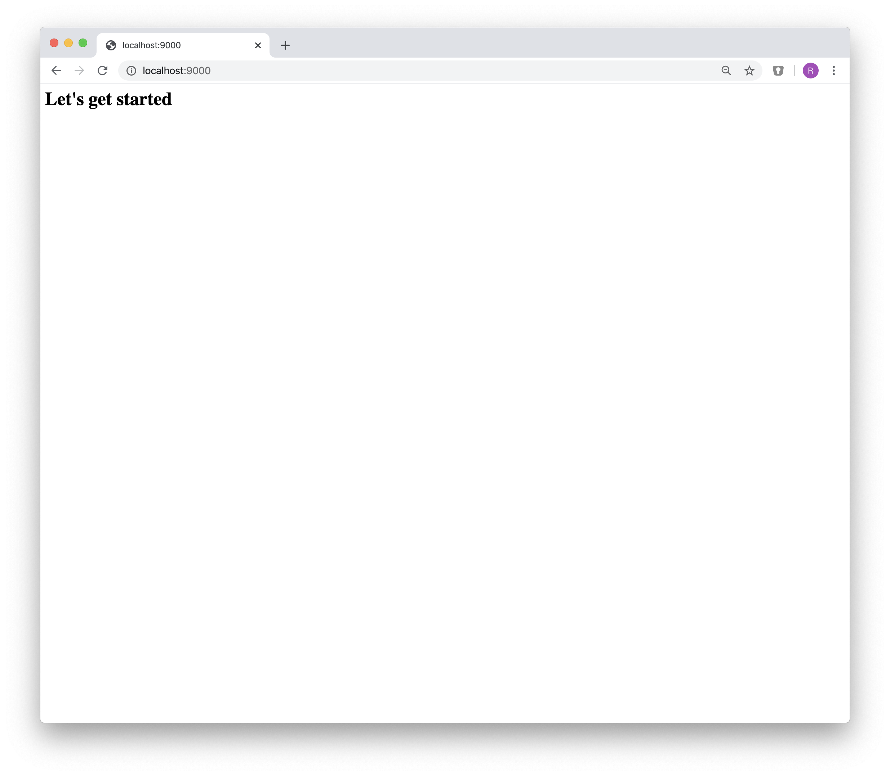

# Build a Dashboard with Django and Bootstrap

[Part 1: Building a base Django project](https://blog.via-internet.de/en/build-a-dashboard-with-django-and-bootstrap-part-1/)

[Part 2: Prepare for dynamic content](https://blog.via-internet.de/en/build-a-dashboard-with-django-and-bootstrap-part-2/)

[Part 3: Handling navigation and the side menu](https://blog.via-internet.de/en/build-a-dashboard-with-django-and-bootstrap-part-3/)

[Part 4: Deploy Django App to Azure](https://blog.via-internet.de/en/build-a-dashboard-with-django-and-bootstrap-part-4/)


## First steps

### Create project

```bash
    django-admin startproject dashboard
    cd dashboard
    python manage.py migrate
    python manage.py runserver 8080
    python manage.py startapp app_base
```

### View current project in browser


### Create first apps

```bash
mkdir -p dashboard/apps/core
python manage.py  startapp Core dashboard/apps/core

mkdir -p dashboard/apps/frontend
python manage.py createapp Frontend dashboard/apps/frontend
```

### Create required components and pages

````bash
    for APP in buttons cards
    do
       mkdir  dashboard/apps/components/$APP
       python3 manage.py createapp $APP dashboard/apps/components/$APP
    done

    for APP in colors borders animations other
    do
        mkdir  -p dashboard/apps/components/$APP
        python3 manage.py startapp $APP dashboard/apps/utilities/$APP
    done

    for APP in login register password notfound blank charts tables
    do
        mkdir  -p dashboard/apps/pages/$APP
        python3 manage.py startapp $APP dashboard/apps/pages/$APP
    done

## Add new apps to project

Modify `dashboard/settings.py`

```python
INSTALLED_APPS = [
   ...

    'dashboard.apps.core',
    'dashboard.apps.frontend',
]
````

Modify `dashboard/urls.py`

```python
from django.urls import path

import dashboard.apps.frontend.views as views

urlpatterns = [
    path('', views.IndexView.as_view(), name='index'),
    path('admin/', admin.site.urls),
]
```

### Create view

#### Modify view in **apps/frontend/views.py**

```python
from django.shortcuts import render
from django.views import generic

class IndexView(generic.TemplateView):
    """
    IndexView:
    """
    module = 'indexView'
    template_name = 'frontend/index.html'
```

### Create template for frontend View

Create template file dashboard/apps/frontend/templates/frontend/index.html

### View current project in browser



## Current folder Structure

So far, we have the following folder structure


## Prepare for administrate your project

### Create admin user

```bash
python manage.py createsuperuser
Username (leave blank to use 'user'): admin
Email address: admin@localhost
Password:
Password (again):
Superuser created successfully.
```

## Add Bootstrap support

Download requires files for Bootstrap, jQuery ad PopperJS

```bash
mkdir -p install/bootstrap
wget  -q https://github.com/twbs/bootstrap/archive/v4.4.1.zip -O install/bootstrap/4.4.1.zip
wget  -q https://github.com/twbs/bootstrap/releases/download/v4.4.1/bootstrap-4.4.1-dist.zip -O install/bootstrap/4.4.1-dist.zip
rm -rf   dashboard/static/vendor/bootstrap/bootstrap-4.4.1-dist
unzip -q install/bootstrap/4.4.1-dist.zip -d       dashboard/static/vendor/bootstrap/
rm -rf   dashboard/static/vendor/bootstrap/4.4.1
mv       dashboard/static/vendor/bootstrap/bootstrap-4.4.1-dist dashboard/static/vendor/bootstrap/4.4.1
```

```bash
mkdir -p dashboard/static/vendor/jquery/3.4.1/js
wget -q https://code.jquery.com/jquery-3.4.1.min.js      -O dashboard/static/vendor/jquery/3.4.1/js/jquery.min.js
wget -q https://code.jquery.com/jquery-3.4.1.slim.min.js -O dashboard/static/vendor/jquery/3.4.1/js/jquery.slim.min.js
```

```bash
make install-popperjs
mkdir -p dashboard/static/vendor/popper/2.0.6/js
wget  -q https://unpkg.com/@popperjs/core@2/dist/umd/popper.min.js          -O dashboard/static/vendor/popper/2.0.6/js/popper.min.js
wget  -q https://unpkg.com/@popperjs/core@2.0.6/dist/umd/popper.min.js.map  -O dashboard/static/vendor/popper/2.0.6/js/popper.min.js.map
```

### Create site templates in `dashboard/templates/site`

### Add templates path to settings

File `dashboard/settings.py`

```python
TEMPLATES = [
    {
        'BACKEND': 'django.template.backends.django.DjangoTemplates',
        'DIRS': [
            BASE_DIR + '/dashboard/templates',
        ],
```

### Add static path to settings

File `dashboard/settings.py`

```python
STATIC_URL = '/static/'
STATICFILES_DIRS = [
    os.path.join(BASE_DIR, APP_NAME + '/static')
]
```

## Modify frontend view template

File dashboard/apps/frontend/templates/index.html

```html
  Dashboard with Django and Bootstrap mkt-nav 
<div class="jumbotron">
	<div class="container"></div>
	FRONTEND
	<div class="container full"></div>
</div>

```

## View current status of project


## Add Bootstrap example for dashboard

For a first start, we will use a [dashboard](https://getbootstrap.com/docs/4.4/examples/dashboard/) template from bootstrap:


## Download required files

### Get Javascript libraries

```bash
DST=dashboard/static/vendor
URL=https://cdnjs.cloudflare.com/ajax/libs

mkdir ${DST}/feather/4.9.0/js
wget -q ${URL}/feather-icons/4.9.0/feather.min.js -O ${DST}/feather/4.9.0/js/feather.min.js

mkdir ${DST}//chart/2.7.3/js
wget -q ${URL}/Chart.js/2.7.3/Chart.min.js -O ${DST}/chart/2.7.3/js/Chart.min.js
```

### Resulting file structure


### Get Bootstrap sources with examples

```bash
BOOTSTRAP_VER=4.4.1
BOOTSTRAP_ZIP=https://github.com/twbs/bootstrap/archive/v${BOOTSTRAP_VER}.zip
BOOTSTRAP_DST=dashboard/static/vendor/bootstrap/4.4.1

rm -rf  install/bootstrap
mkdir -p  install/bootstrap
wget -q ${BOOTSTRAP_ZIP} -O install/bootstrap/${BOOTSTRAP_VER}.zip

rm -rf ${BOOTSTRAP_DST}/bootstrap-${BOOTSTRAP_VER}
mkdir -p ${BOOTSTRAP_DST}/

unzip -q install/bootstrap/${BOOTSTRAP_VER} -d install
```

### Examine and study examples

All examples from the getbootstrap.com website are located in `install/bootstrap-4.4.1/site/docs/4.4/examples`


### Copy template files to django project folders

Copy the css stylesheet

```bash
cp install/bootstrap-4.4.1/site/docs/4.4/examples/dashboard/dashboard.css  dashboard/static/site/css/
```

Copy the javascript file

```bash
cp install/bootstrap-4.4.1/site/docs/4.4/examples/dashboard/dashboard.js dashboard/static/site/js
```

Copy html file

```bash
cp install/bootstrap-4.4.1/site/docs/4.4/examples/dashboard/index.html  dashboard/templates/site/dashboard.html
```

After this, we should have the following files in folders:

<table>
<tr>
<td>

</td>
<td>

```bash
find dashboard -name "dashboard*" -type f
dashboard/static/site/css/dashboard.css
dashboard/static/site/js/dashboard.js
dashboard/templates/site/dashboard.html
```

</td>
</tr>
</table>

### Final Step: modify `site/base.html` template

The dashboard.html template file from the bootstrap examples contains only the required html for the dashboard itself.

What we need to add is the information, where the stylesheets and the javascript files (including bootstrap itself) are located.

The base structure for a template file using bootstrap (or any other UI / layout framework) looks like this:

-   starting with a header, specifying meta information and links for the used css files
-   following the main part, containing the information display on the website
-   end up the the information, where the javascript files are located

The resulting template should look like this


File `dashboard/templates/site/base.html`

```html


<!DOCTYPE html>
<html>
	<head>
		<title>Home</title>
		<link rel="icon" type="image/png" href="" />
		<meta http-equiv="Content-Type" content="text/html; charset=utf-8" />
		<meta http-equiv="Content-Language" value="en-US" />
		<meta name="viewport" content="width=device-width, initial-scale=1.0, shrink-to-fit=no" />

		<link href="" rel="stylesheet" media="screen" />
		<link href="" rel="stylesheet" media="screen" />
		<link href="" rel="stylesheet" media="screen" />
	</head>

	<body>
		<main role="main">
			<!--
			Insert content of dashboard.html here
 			-->

			<div id="site-wrapper">
				MISSING CONTENT
			</div>
		</main>
	</body>

	<script src=""></script>
	<script src=""></script>
	<script src=""></script>
	<script src=""></script>

	<script src=""></script>
	<script src=""></script>

	<script src=""></script>
	<script src=""></script>
</html>
```

## Appendix

### Install additional components

```bash
wget https://fonts.googleapis.com/css?family=Nunito:200,200i,300,300i,400,400i,600,600i,700,700i,800,800i,900,900i nunito.css
--2020-02-22 10:05:45--  https://fonts.googleapis.com/css?family=Nunito:200,200i,300,300i,400,400i,600,600i,700,700i,800,800i,900,900i -O dashboard/static/vendor/fonts/nunito.css
```
